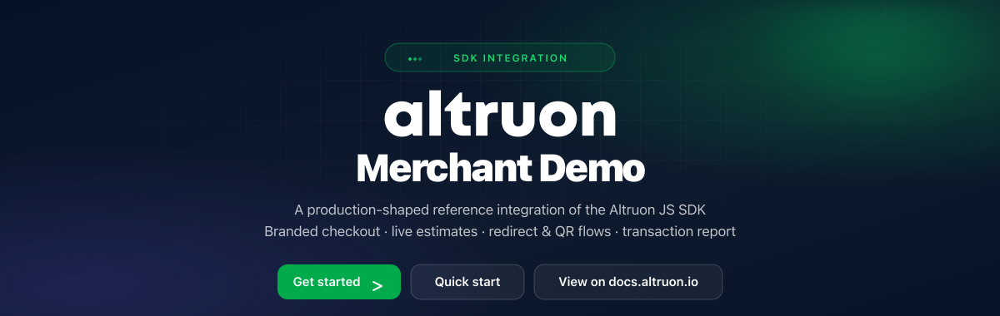

<p align="center">
  <a href="https://www.altruon.io">
    
  </a>
</p>

<p align="center">
  <a href="https://docs.altruon.io/docs/intro">Documentation</a> ·
  <a href="https://docs.altruon.io/docs/developers/altruon-js/quick-start">SDK quick start</a> ·
  <a href="https://docs.altruon.io/docs/developers/altruon-js/session-api">Session API</a> ·
  <a href="https://docs.altruon.io/docs/developers/altruon-js/callbacks">Callbacks</a> ·
  <a href="https://www.altruon.io">altruon.io</a>
</p>

> ⚠️ **This repository is for demo and educational purposes only.**  
> It shows a recommended SDK integration pattern with a minimal Express backend.
> Do not deploy it to production without adding authentication, CORS restrictions,
> and your own operational hardening. See [SECURITY.md](SECURITY.md).

---

## Requirements

- **Node.js** ≥ 20.19
- An **Altruon sandbox account** with a billing provider connected (Stripe, Chargebee, Recurly, …)
- A **payment gateway** routed for your plan currency in the Altruon Dashboard

---

## What's inside

The demo ships as a fictional SaaS brand called **MySaas**, and you can re-brand it
with **your own name, logo and color** in seconds from the in-app configuration
panel — so prospects see *their* checkout, not ours.

| | |
|---|---|
| **Checkout page** | Customer form, billing-country-aware **tax & discount estimate**, coupon codes, and the embedded Altruon payment component |
| **Redirect flows** | Friendly disclaimer modal (with countdown) before 3-D Secure / bank redirects |
| **QR flows** | Scan-to-pay overlay popup for Pix / UPI style payment methods |
| **Result page** | Status hero + transaction report with **deep links into your payment gateway and billing provider dashboards** |
| **Setup gate** | Validates your credentials against the Altruon API on startup and tells you exactly what to fix |
| **Config panel** | Change billing connection, plan, addons, currency, and storefront branding live — no restart |

## Architecture

Two small pieces, mirroring how a real integration should be structured:

```
┌─────────────────────┐         ┌─────────────────────┐         ┌──────────────────┐
│  client/  (React)   │  /api   │  server/  (Express) │  HTTPS  │   Altruon API    │
│  publishable key    ├────────►│  SECRET key (.env)  ├────────►│  {tenant}.api.   │
│  + Altruon JS SDK   │         │  session/estimate/  │         │  sandbox.        │
│                     │         │  transaction proxy  │         │  altruon.io      │
└─────────────────────┘         └─────────────────────┘         └──────────────────┘
```

> **Why a backend?** Creating checkout sessions and reading transaction details
> require your **secret key**. A secret key in browser code is public — so it
> lives in `server/.env` and the browser only talks to the demo's own `/api/*`
> routes. The frontend uses only the **publishable key** (safe by design) for
> the Altruon JS SDK. Use the same separation in production.

### Payment flow

1. `POST /api/session` → the backend calls Altruon's
   [`POST /api/session/v1/create`](https://docs.altruon.io/docs/developers/altruon-js/session-api)
   with your plan / addons / coupons and gets back a single-use `session_id`.
2. The frontend binds the SDK:
   `altruon.init(publishableKey, tenant).setSession(id).renderComponent('#container')`.
3. On **Subscribe**, the shopper's details are synced
   (`setCustomer`, `setAddresses`) and `processPaymentAndSubscription()` runs.
4. The outcome arrives via [SDK callbacks](https://docs.altruon.io/docs/developers/altruon-js/callbacks):
   - `onSuccess` → navigate to `/result?trx_id=…`
   - `onFailure` → failure modal (retry creates a **new** session)
   - `onActionRequired` → `REDIRECT` (disclaimer modal) or `QR_CODE` (QR overlay)
5. After off-site flows, Altruon redirects back to `/result?trx_id=…`, where the
   demo fetches the full transaction report — including `urlAtGateway` and
   `urlAtBilling` deep links.

## Quick start

```bash
# 1. Install everything (root + server + client)
npm run setup

# 2. Configure your credentials
cp server/.env.example server/.env
#    → fill in ALTRUON_SECRET_KEY, ALTRUON_PUBLISHABLE_KEY, ALTRUON_DOMAIN,
#      BILLING_CONNECTION_ID, PLAN_ID, CURRENCY (see comments in the file)

# 3. Run it (backend on :4242, frontend on :3030)
npm run dev
```

Open <http://localhost:3030>. The setup gate validates your configuration
against the Altruon API and walks you through anything that's missing.

### Where do the values come from?

| `.env` value | Where to find it |
|---|---|
| `ALTRUON_SECRET_KEY` / `ALTRUON_PUBLISHABLE_KEY` | Altruon Dashboard → Developers → API Keys |
| `ALTRUON_DOMAIN` | Your tenant domain, e.g. `mycompany.sandbox.altruon.io` (bare tenant name works too) |
| `BILLING_CONNECTION_ID` | Dashboard → Integrations → Billing Providers (UUID of the connection) |
| `PLAN_ID` | The plan's item-price id at your billing provider (e.g. a Stripe price id) |
| `ADDON_IDS` | Optional, comma-separated recurring addon item-price ids |
| `CURRENCY` | ISO 4217 code that exists on the plan price |

> **Naming note:** the session create API calls this value `billingPlatformId`,
> while the estimate endpoint path calls it `billingConnectionId`. They are the
> same UUID — this demo uses one config value for both.

## Re-branding the storefront

Two ways:

- **Live (no restart):** click the gear button (bottom right) → *Storefront
  branding* → set display name, logo (URL or upload) and primary color. The
  header, order summary, buttons and the embedded Altruon component restyle
  instantly. Settings persist for the browser session.
- **Permanent:** set `MERCHANT_DISPLAY_NAME` and `MERCHANT_LOGO_URL` in
  `server/.env`.

## Project tour

```
server/
  src/altruonClient.js   ← the only code that talks to Altruon with the secret key
  src/routes.js          ← /api/config /api/validate /api/estimate /api/session /api/transactions/:id
client/src/
  context/DemoConfigContext.jsx  ← .env defaults + config-panel overrides (merged)
  components/SetupGate.jsx       ← startup credential validation checklist
  components/ConfigPanel.jsx     ← Altruon settings + storefront branding editor
  components/OrderSummary.jsx    ← live estimate: line items, discount, tax, total
  components/RedirectModal.jsx   ← pre-redirect disclaimer (onActionRequired: REDIRECT)
  components/QrOverlay.jsx       ← scan-to-pay popup (onActionRequired: QR_CODE)
  pages/CheckoutPage.jsx         ← the full SDK integration walkthrough
  pages/ResultPage.jsx           ← /result?trx_id=… transaction report
```

Every file is heavily commented — the code is meant to be read.

## Production build

```bash
npm run build   # builds client/dist
npm start       # Express serves the API and the built frontend on :4242
```

## Troubleshooting

| Symptom | Likely cause |
|---|---|
| Setup gate: *"Altruon rejected the secret key (401)"* | Wrong `ALTRUON_SECRET_KEY`, or the key belongs to a different tenant than `ALTRUON_DOMAIN` |
| Setup gate: *"Could not reach the Altruon API"* | Typo in `ALTRUON_DOMAIN` (use `mycompany.sandbox.altruon.io`) |
| *"session creation failed (4xx)"* | `BILLING_CONNECTION_ID` / `PLAN_ID` don't exist, or `CURRENCY` isn't available on the plan price |
| Estimate loads but payment fails immediately | No payment gateway routed for the currency/method — check Dashboard → Routing |
| Payment form doesn't appear | The SDK script (`cdn.altruon.io`) may be blocked; check the browser console |

## Security checklist (for your real integration)

- ✅ Secret key only in server-side environment config — never in the browser, never committed
- ✅ Sessions created server-side; the frontend receives only the `session_id`
- ✅ Transaction details fetched server-side
- ✅ Publishable key + tenant are the only Altruon values exposed to the client
- ⚠️ This demo's `/api/*` routes are unauthenticated for simplicity — in
  production, protect them with your app's user authentication.

---

<p align="center">
  Built with the <a href="https://docs.altruon.io">Altruon</a> platform ·
  Questions? <a href="https://www.altruon.io">altruon.io</a> ·
  <a href="CONTRIBUTING.md">Contributing</a> ·
  <a href="SECURITY.md">Security</a>
</p>
